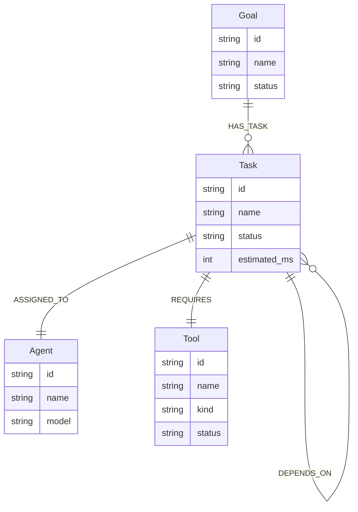
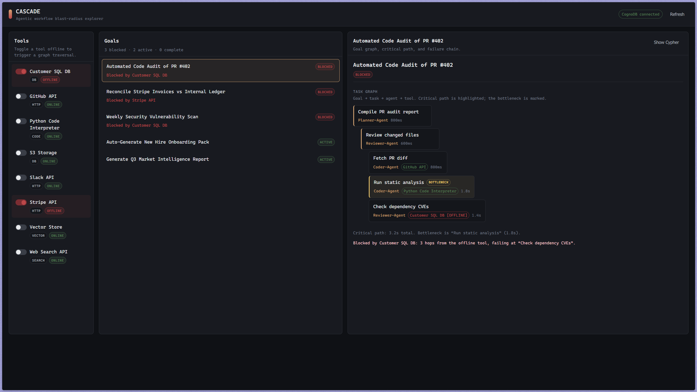

# CASCADE — Agentic Workflow Inspector

A graph-database application that models agentic workflows and answers connectivity questions a relational database would find awkward.

**Live demo:** https://cascade-graph-app.onrender.com  
**Screen recording:** https://your-recording-link.example.com

## Why a graph database?

Agentic workflows are DAGs: goals decompose into tasks, tasks depend on other tasks, and leaf tasks require external tools. The interesting questions are about variable-depth connectivity:

1. **Blast radius** — which goals are blocked when a tool goes offline? This is a 4-hop traversal (`Goal → Task → Task → Tool`) with a path reconstruction. In SQL it is a recursive CTE with cycle guards. In Cypher it is a bounded pattern.

2. **Critical path** — what is the longest dependency chain weighted by estimated runtime? In SQL this needs a recursive CTE, a running sum, and a self-join. In Cypher it is a single `MATCH p = ...` with `reduce`.

3. **Blocked-goal reasoning** is derived from the graph, not stored state. A goal is blocked only when an offline tool sits on every path to its leaf tasks.

## Data model



- `(A)-[:DEPENDS_ON]->(B)` means A depends on B; B must finish before A starts.
- `estimated_ms` lives on `Task` nodes so the critical-path query weights edges naturally.
- `Tool.status` is the only mutable property. Toggling a tool offline recomputes blocked goals from the graph.

## Setup

### 1. CognoDB Cloud instance

1. Sign up at https://console.cognodb.com/signup (free tier, no credit card).
2. Create a free `c0` instance and pick a region.
3. Copy the connection URI (`bolt+s://<instance-id>.databases.cognodb.cloud`) and the generated password for user `cognodb`.

### 2. Configure secrets

```bash
cp .env.example .env
# Edit .env and fill in COGNODB_URI and COGNODB_PASSWORD
```

### 3. Seed the database

```bash
uv run python seed.py
```

Expected output:

```text
CASCADE seed complete:
  goals      5
  tasks      21
  agents     5
  tools      8
  has_task   5
  depends_on 15
  requires   16
```

### 4. Run the app

```bash
uv run cascade-api
```

Open http://localhost:8000.

### Or run with Docker

```bash
docker compose up --build
```

## Main queries

### Blast radius

```cypher
MATCH (tool:Tool {id: $tool_id, status: 'OFFLINE'})<-[:REQUIRES]-(failedTask:Task)
MATCH p = (goal:Goal)-[:HAS_TASK]->(rootTask:Task)-[:DEPENDS_ON*0..4]->(failedTask)
WHERE goal.status <> 'COMPLETE'
RETURN goal.id, goal.name, failedTask.name,
       [n IN nodes(p) WHERE n:Task | n.name] AS failure_chain
ORDER BY length(p)
```

Returns every goal blocked by the offline tool and the shortest dependency chain from goal root to the failing task.

### Critical path

```cypher
MATCH (goal:Goal {id: $goal_id})-[:HAS_TASK]->(rootTask:Task)
MATCH p = (rootTask)-[:DEPENDS_ON*0..6]->(leafTask:Task)
WHERE NOT (leafTask)-[:DEPENDS_ON]->(:Task)
WITH p, reduce(total = 0, n IN nodes(p) | total + n.estimated_ms) AS total_ms
ORDER BY total_ms DESC
LIMIT 1
RETURN total_ms,
       [n IN nodes(p) | {id: n.id, name: n.name, estimated_ms: n.estimated_ms}]
```

Returns the longest dependency chain weighted by `estimated_ms`, which predicts the goal's latency and exposes the bottleneck step.

### Currently blocked goals

```cypher
MATCH (tool:Tool {status: 'OFFLINE'})<-[:REQUIRES]-(failedTask:Task)
MATCH p = (goal:Goal)-[:HAS_TASK]->(:Task)-[:DEPENDS_ON*0..4]->(failedTask)
WHERE goal.status <> 'COMPLETE'
RETURN goal.id, goal.name, tool.name AS root_cause
```

This query powers the landing dashboard. Blocked status is derived from the graph, not stored on the goal node.

## Dashboard

### Cascade Dashboard



## Project structure

```text
.
├── cascade/
│   ├── config.py      # env-driven settings
│   ├── db.py          # driver + all Cypher queries
│   ├── main.py        # FastAPI routes + static UI
│   └── static/        # single-page app
├── seed.py            # idempotent data loader
├── pyproject.toml
├── Dockerfile
├── docker-compose.yml
└── README.md
```
